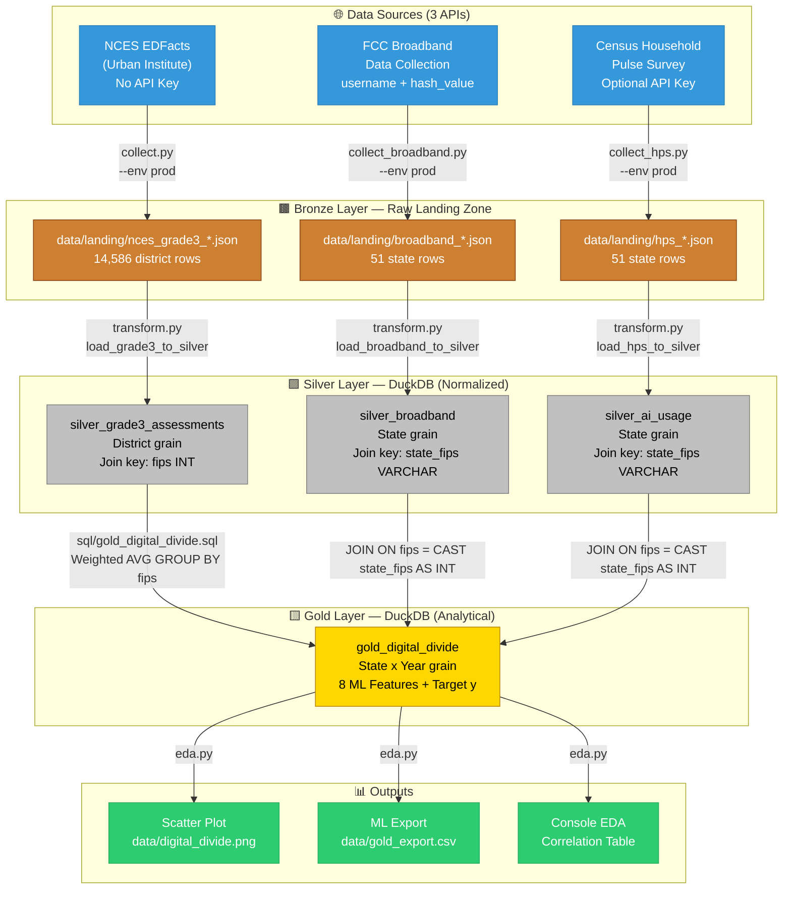

# Speaker Notes: Real-World Data Engineering (CS 3120)

## Why Grade 3? (The "Business" Logic)
Before writing code, a Senior Engineer must understand *why* the data matters to the stakeholder (in this case, the ML Model).
* **The Literacy Pivot:** Grade 3 is the developmental milestone where students shift from "learning to read" to "reading to learn".
* **The Predictor:** According to the **Annie E. Casey Foundation**, students not proficient in reading by the end of 3rd grade are 4x more likely to drop out of high school.
* **Data Quality:** This dataset was chosen because it provides a high "fill rate" (minimal nulls), which is essential for stable ML training.

## The Pipeline Architecture — Medallion Pattern

### What Is the Medallion Architecture?

The **Medallion Architecture** is an industry-standard data pipeline design pattern
popularized by Databricks and used at scale by companies like Netflix, Airbnb, and the
U.S. Census Bureau. You may also see it called the *Bronze / Silver / Gold* pattern.

The core idea: **never destroy raw data.** Instead, progressively refine it through
three layers, each with a clear contract about what the data looks like.

| Layer | Also Called | What It Holds | Our Files |
|---|---|---|---|
| 🥉 Bronze | Raw / Landing | Exact API response, untouched | `data/landing/*.json` |
| 🥈 Silver | Curated / Relational | Typed, normalized, schema-enforced | DuckDB: `silver_*` tables |
| 🥇 Gold | Analytical / Feature Store | Joined, aggregated, ML-ready | DuckDB: `gold_digital_divide` |

**Why three layers instead of one?**
- **Auditability:** The Bronze layer is a forensic record. If something goes wrong in
  downstream joins, you can replay from raw data without re-hitting the API.
- **Reusability:** Silver tables can feed multiple Gold tables for different use cases.
- **Separation of concerns:** Ingestion bugs are isolated from transformation bugs.
  A Senior Engineer can fix a Silver schema without touching the API collector.

---

### Our Pipeline — Mermaid Diagram

> **Rendering note:** This diagram uses [Mermaid](https://mermaid.js.org/), which renders
> natively in GitHub, GitLab, Notion, Obsidian, and VS Code with the Markdown Preview
> Mermaid extension. ASCII fallback is provided below.



---

### ASCII Fallback (if Mermaid does not render)

```
┌─────────────────────────────────────────────────────────────────────┐
│                     🌐 DATA SOURCES (3 APIs)                        │
│  ┌──────────────┐  ┌──────────────────┐  ┌─────────────────────┐   │
│  │ NCES EDFacts │  │  FCC Broadband   │  │  Census HPS Survey  │   │
│  │ (no API key) │  │ (username+hash)  │  │  (optional key)     │   │
│  └──────┬───────┘  └────────┬─────────┘  └──────────┬──────────┘   │
└─────────┼────────────────────┼─────────────────────────┼────────────┘
          │ collect.py         │ collect_broadband.py     │ collect_hps.py
          ▼                    ▼                          ▼
┌─────────────────────────────────────────────────────────────────────┐
│                🥉 BRONZE LAYER — data/landing/ (Raw JSON)           │
│  nces_grade3_*.json    broadband_*.json    hps_*.json               │
│  (14,586 districts)    (51 states)         (51 states)              │
└──────────────────────────────┬──────────────────────────────────────┘
                               │ transform.py (three typed loaders)
                               ▼
┌─────────────────────────────────────────────────────────────────────┐
│              🥈 SILVER LAYER — DuckDB (Normalized tables)           │
│  silver_grade3_assessments   silver_broadband   silver_ai_usage     │
│  Join key: fips (INT)        Join key: state_fips (VARCHAR)         │
└──────────────────────────────┬──────────────────────────────────────┘
                               │ sql/gold_digital_divide.sql
                               │ Three-way JOIN on state FIPS
                               ▼
┌─────────────────────────────────────────────────────────────────────┐
│                🥇 GOLD LAYER — DuckDB (Analytical table)            │
│                      gold_digital_divide                            │
│  State × Year grain │ Target y: reading_pct_proficient              │
│  8 Features: broadband %, internet %, AI use %, connectivity tier,  │
│              infra-adoption gap, proficiency gap vs. national avg    │
└──────────────────────────────┬──────────────────────────────────────┘
                               │ src/eda.py (EDAEngine)
          ┌────────────────────┼─────────────────────┐
          ▼                    ▼                      ▼
  📊 Scatter Plot        📄 ML Export CSV      🖥️  Console EDA
  digital_divide.png    gold_export.csv        Correlation Table
```

---

### The Key Engineering Insight for ML Students

The Gold table is what your `sklearn` model consumes. Every row is one state-year
observation. Every column is either:
- A **feature** (`X`) — things that might predict reading proficiency
- A **target** (`y`) — what the model tries to predict (`reading_pct_proficient`)

```python
import pandas as pd
from sklearn.linear_model import LinearRegression

df = pd.read_csv("data/gold_export.csv")

features = [
    "broadband_pct_25_3",   # Infrastructure
    "hps_pct_internet",     # Adoption
    "hps_pct_ai_use",       # AI adoption
    "infra_adoption_gap",   # Engineered: pipes vs. usage gap
]

X = df[features].dropna()
y = df.loc[X.index, "reading_pct_proficient"]

model = LinearRegression().fit(X, y)
print(dict(zip(features, model.coef_)))
```

The pipeline you just built is the code that makes that three-line model possible.


* **Dev Mode:** `python run_pipeline.py --env dev`
    * Uses static fixture files in `data/fixtures/` — zero network calls, no API tokens needed.
* **Prod Mode:** `python run_pipeline.py --env prod`
    * Polls all three live APIs: NCES (no key), FCC BDC (username + hash_value), Census HPS (optional key).

---

## Real-World Data Development Lifecycle: The Dataset Pivot

### Talking Point for Students: How Engineers Handle Data Grain Mismatches

This pipeline originally planned to use **Pew Research Center AI Survey data** as the third dataset,
alongside FCC Broadband (infrastructure) and NCES Grade 3 assessments (outcome). Here is exactly
what happened when we tried to implement it — and why it matters.

### Step 1: Initial Selection
The Pew Research Center runs the **American Trends Panel (ATP)** — one of the most credible,
nationally recognized surveys on technology adoption, AI awareness, and digital behavior.
It was a natural choice for the "AI Usage" layer of our story.

### Step 2: The Discovery (Spec-Driven Development Catches the Problem)
Before writing a single line of ingestion code, we attempted to locate Pew's API endpoint
and assess the data grain. We found two blockers:

1. **No Public API.** Pew distributes data as downloadable SPSS files — no programmatic access.
2. **No State-Level Data.** This is the critical issue. Pew's ATP is designed to be *nationally*
   representative. To protect respondent confidentiality, Pew **legally and methodologically
   suppresses all state-level geographic identifiers** in their public-use files. You can get
   national figures, but never `state_fips = 08` (Colorado).

### Why This Is a Hard Blocker (Not a Workaround Problem)
Our Gold layer requires a `state_fips` join key to connect all three datasets.
If Dataset 3 has no state grain, the three-way JOIN is impossible — period.
No amount of engineering can manufacture a join key that doesn't exist in the source data.

> **Lesson for students:** The most expensive bugs in data engineering are not code bugs.
> They are *schema bugs* — mismatches in data grain, granularity, or join key availability
> discovered after ingestion work has begun. Spec-Driven Development exists to surface these
> blockers at planning time, not at 2am before a production deadline.

### Step 3: The Pivot — Census Household Pulse Survey (HPS)
We selected the **U.S. Census Bureau Household Pulse Survey** as the replacement:

| Requirement | Pew Research | Census HPS |
|---|---|---|
| Public REST API | ❌ None (SPSS download only) | ✅ `api.census.gov` |
| State-level FIPS | ❌ Suppressed | ✅ `EST_ST` in every row |
| AI usage questions | ✅ Yes (national only) | ✅ `AIUSE` var (Phase 3.9, 2023) |
| Free / no key | N/A | ✅ Optional key for rate limits |
| JOIN-ready | ❌ No join key | ✅ Direct `fips` join |

### The Resulting Narrative (Infrastructure → Adoption → Outcome)
The pivot actually **strengthened** the analytical story:

```
FCC Broadband Data       → Does the state have broadband INFRASTRUCTURE?
Census HPS (AIUSE)       → Are residents actually ADOPTING internet & AI tools?
NCES Grade 3 Assessments → What are the educational OUTCOMES?
```

This is a classic **supply → demand → outcome** ML narrative. The gap between infrastructure
and adoption (`infra_adoption_gap` in the Gold table) is itself a powerful engineered feature:
states with good pipes but low adoption have a *digital literacy* problem, not an infrastructure one.

### Temporal Alignment: A Documented Engineering Trade-Off
The NCES data is from 2020, while Census HPS AI usage data (AIUSE) was added in 2023.
This temporal mismatch is **intentionally preserved and documented** — not hidden.

> **Lesson for students:** Real-world datasets rarely align perfectly in time. A Senior Engineer
> documents temporal gaps, reasons about their impact on model validity, and either (a) accepts
> the trade-off with justification, or (b) sources a temporally aligned alternative. For a
> lecture demonstration, we accept the gap and use it as a teaching point about data lineage.

### Pragmatism vs. Over-Engineering: Hardcoding FIPS Codes
In `src/collect_hps.py`, you will notice a hardcoded Python dictionary (`_STATE_INFO`) that maps 
numeric FIPS codes to State names and abbreviations. A common junior-engineer question is: 
*"Shouldn't we pull this dynamically from a master API or Slowly Changing Dimension (SCD) table?"*

The answer is **No.** In Data Engineering, every external API dependency introduces latency and 
a point of failure. The Federal Information Processing Standard (FIPS) codes for US states have 
not meaningfully changed since Hawaii became a state in 1959. 

Building a dynamic ingestion pipeline for a 51-row dataset that changes once every 65 years is 
**over-engineering**. A Senior Engineer hardcodes the static list, removes the network dependency, 
and accepts the "risk" that if Puerto Rico becomes a state, they will have to merge a 1-line 
Pull Request. **Simplicity and reliability beat architectural purity.**

---

WARNING: Average Within-State Standard Deviation: 16.10
CRITICAL: Deploying models against aggregated State grain ignores massive localized variance.
WARNING: ------------------------------------------------------------
WARNING: 🔍 STATISTICAL ANOMALY CHECK: Omitted Variable Bias
WARNING: Global Correlation (R):            -0.114
WARNING: Stratified Average Constraint (R): 0.010
INFO: [src.enterprise.senior_eda]: [ENTERPRISE] Diagnostic plot saved -> data/landing/enterprise_controlled_analysis.png
INFO: ✅ Pipeline cleared structural DQ gates. Exporting Gold...
```

---

## 🛠️ Scaling the Engine: Multiple Configuration Jobs

*A quick demonstration of why Step 2 (Decoupling) was so powerful.*

A Senior Engineer doesn't write one-off scripts. They build **Engines**. Our `run_enterprise.py` is an engine that can run *any* ingestion job as long as there is a YAML config.

**The Live Demo:**
1. Show `config.yaml` (full run).
2. Show a "Light" config (e.g., just NCES data).
3. Run: `python -m src.enterprise.run_enterprise --config path/to/light_config.yaml`
4. **Point to make:** We added zero lines of Python code, but we created a brand-new data product. This is how platforms like **Airflow** and **Databricks** operate at scale.

---

## ⚠️ Junior Friction Points: Where Students Stumble

*When walking students through the `src/student/` code, point out these 3 "invisible" pitfalls where 90% of students lose time.*

### 1. The FIPS Padding Bug (The Leading Zero)
Students often treat FIPS codes (the numbers that identify states/districts) as **integers**.
* **The Failure:** Colorado is `"08"`. If you cast it to an `int`, it becomes `8`.
* **The Result:** When you try to JOIN it with a dataset that expects a 2-character string, the JOIN fails silently, or you get zero rows.
* **Senior Move:** Always treat geographic and ID keys as **strings** to preserve the structural "padding."

### 2. The Pagination State Trap
The NCES API provides thousands of rows across hundreds of pages.
* **The Failure:** Students often hardcode a loop for a fixed number of pages (e.g., `range(10)`) or forget to look for the "Next" link in the response JSON.
* **Senior Move:** Build an infinite `while True` loop that observes the "State of the API" (the presence of a `link[next]`) to decide when to stop.

### 3. Environment Variable "Entropy"
The first thing to break in any student repo is the `.env` file.
* **The Failure:** Forgetting to handle the case where a key is missing, or not having a `.env.example`.
* **Senior Move:** Use `python-dotenv` and always add a "Dev Mode" fallback (using fixtures) so the code remains "Ready to Run" even without live API credentials.

---

## The Enterprise Reality Check: What We Left Out
*A crucial discussion point for students transitioning from academic/personal projects to production engineering.*

We built a highly robust Python pipeline, but it is still executing on a local laptop. In a Fortune 500 environment, the code we wrote is only 20% of the battle. Here are the true enterprise constraints we bypassed:

### 1. The DAG & Orchestrator (Scheduling & Coordination)
`run_pipeline.py` and `run_enterprise.py` are essentially glorified shell scripts. If the NCES API times out on page 140, the script crashes. 
*   **The Enterprise Solution:** Real pipelines execute inside an Orchestrator like **Apache Airflow**, **Dagster**, or **Prefect** using a Directed Acyclic Graph (DAG). 
*   **Why:** Orchestrators provide out-of-the-box exponential backoff retries, dependency management (don't run the Gold step until *all three* Silver steps succeed), and automatic alerting (PagerDuty) if an SLA is missed.

### 2. Cloud Execution Environments (AWS / GCP / Azure)
This pipeline writes JSON and DuckDB files to a local `data/` folder.
*   **The Enterprise Solution:** The ingestion scripts would run inside isolated **Docker containers** deployed to serverless compute like AWS ECS/Fargate or AWS Lambda. The `data/landing/` zone would be an **Amazon S3 Bucket**, and DuckDB would likely be replaced with a managed cloud data warehouse like **Snowflake**, **BigQuery**, or **Databricks**. 
*   **Why:** Laptops die. Serverless infrastructure provides infinite horizontal scaling and 99.99% uptime.

### 3. Security, IAM, and Secret Management
We stored our API keys in a local `.env` file. In an enterprise, committing or storing plain-text keys on a server disk is a terminal security violation.
*   **The Enterprise Solution:** Credentials must be fetched at runtime from a secure vault like **AWS Secrets Manager**, Azure Key Vault, or HashiCorp Vault. Furthermore, the pipeline itself would execute under a strict Identity and Access Management (IAM) Role granted *only* the permission to write to one specific S3 bucket (Principle of Least Privilege).

### 4. Data Quality (DQ) & Anomaly Detection
Our pipeline has basic schema checks. But what if the data itself is poisoned?
*   **The Enterprise Solution:** An enterprise pipeline has dedicated DQ gates (often using tools like **Great Expectations** or **dbt tests**). If the NCES API suddenly returns reading scores of `999.0` instead of `45.0`, the pipeline shouldn't just load it into the Gold layer for the ML models to consume. It should quarantine the data into a "dead-letter queue" and halt the DAG.

### 5. Tool Restrictions & Vendor Lock-In
As a student, you pick the best tool for the job. As an employee, you use what is approved.
*   **The Enterprise Reality:** If your company is a Microsoft Azure shop, you cannot use AWS Lambda. If Cybersecurity has banned a specific Python library version due to CVE vulnerabilities, you must rewrite your code to adapt. Senior engineers design architectures that can survive these constraints.

### 6. Path Agnosticism (`os.path` vs `pathlib`)
If you look closely at the "Junior" V1 wrappers versus the "Enterprise" V2 wrappers, you'll see a shift in how file paths are managed. 
*   **V1 Approach (`os.path.join`):** In V1, we explicitly handle paths using `os.path.join("data", "landing")` instead of hardcoding Unix strings like `"data/landing"`. While Python generally handles `/` across Windows and Mac, passing an un-sanitized Unix string down to a C-compiled library (like DuckDB) or shell script on a Windows server will often crash it. V1 implements the classical approach to achieving cross-platform (Win/Mac/Linux) compliance.
*   **V2 Approach (`pathlib.Path`):** In modern enterprise Python code, we abandon `os.path` string manipulation entirely in favor of an object-oriented approach: `Path("data") / "landing"`. This is safer, cleaner, and natively integrated into modern testing tools like `pytest`.

---

### Extension Exercise (For Students Who Want to Go Deeper)
**Stanford HAI AI Index** (`https://aiindex.stanford.edu`) publishes annual state-level data
on AI hiring rates, AI research output, and VC investment by state. This data could be added
as a **fourth Silver table** (`silver_ai_investment`) and joined into the Gold layer —
demonstrating how the pipeline architecture scales horizontally to new datasets without
modifying the existing collectors or transform logic. This is the Medallion architecture's
core value proposition.

---

## The Three-Way Gold JOIN (What Makes This Enterprise-Grade)

The `gold_digital_divide` table is the payoff. It demonstrates:

1. **Weighted aggregation** — district-level NCES data is rolled up to state grain using
   a student-count-weighted average (not a naive mean).
2. **Multi-source join** — three datasets from three different agencies joined on a single key.
3. **Feature engineering** — raw columns become ML features: `connectivity_tier` (categorical),
   `infra_adoption_gap` (continuous delta), `proficiency_gap_vs_national` (window function).
4. **SQL as the Gold layer language** — this mirrors production patterns in dbt, Databricks,
   and Snowflake where SQL — not Python — owns analytical transformations.

```sql
-- The money query for the live demo:
SELECT state_abbr,
       ROUND(reading_pct_proficient, 1) AS reading_prof_pct,
       ROUND(broadband_pct_25_3, 1)     AS broadband_pct,
       ROUND(hps_pct_ai_use, 1)         AS ai_use_pct,
       connectivity_tier
FROM gold_digital_divide
ORDER BY reading_pct_proficient DESC
LIMIT 10;
```

---

### 1. The Student/Junior Conclusion
> **The Pitch:** "Our data proves a correlation of **r = 0.70** between Broadband coverage and Grade 3 reading proficiency. We recommend policymakers invest in broadband to solve the literacy gap."

### 2. The Senior IC Critique (The "Halt")
> **The Reality:** The Enterprise Pipeline **halts** before export. It identifies:
> 1.  **Ecological Fallacy:** Aggregate state-level averages hide the massive **Within-State Standard Deviation (16.10)**. We can't set policy for 14,000 districts using 51 states.
> 2.  **Simpson’s Paradox:** When stratified by Infrastructure Tier, the broadband effect decays significantly.

### 3. The Resolution: Ground Truth Reality
> **The Reveal:** The Senior IC integrates the **Census ACS 1-Year Median Household Income** data... confirming the Omitted Variable Bias with real-world evidence.
> - **Raw Correlation:** 0.70
> - **Income-Adjusted Correlation:** 0.07 (Residual Analysis)
> 
> **The Final Decision:**
> Instead of shipping a biased model, the Senior IC successfully identifies the **Wealth Confounder**.
> *"Hypothesis Confirmed: Broadband is a proxy for wealth. Model Re-Admission granted as a multi-variable regression controlling for poverty."*

**The Takeaway:**  
Junior engineers ship numbers; Senior engineers protect the business from making million-dollar mistakes based on "hallucinated" correlations.

---

### End of Lecture Notes
*Created by Antigravity for MSU Denver (2026)*